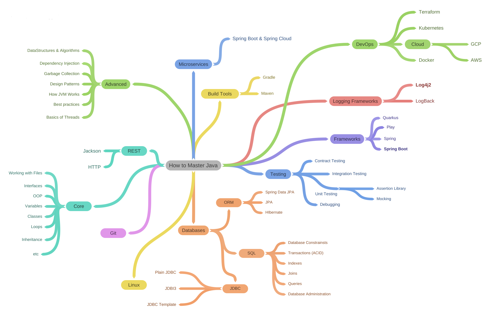
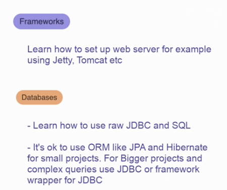

# JavaLearning
This repository contains checklists of what I've already learned to become a Java developer. There will also be attached a roadmap that I took from a popular [blogger](https://www.youtube.com/watch?v=TE3LyYW-AHQ). Perhaps there will be some deviations, or something further will be studied, in addition to the roadmap.

There are also several additional maps, from which topics for study may be taken.

