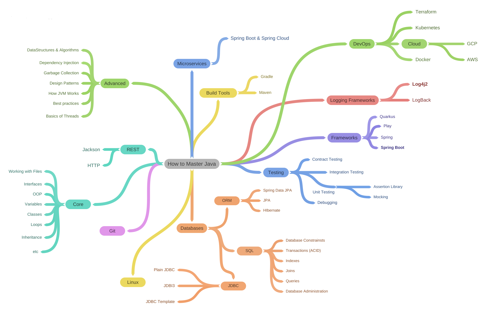

# JavaLearning
This repository contains checklists of what I've already learned to become a Java developer. There will also be attached a roadmap that I took from a popular [blogger](https://www.youtube.com/watch?v=TE3LyYW-AHQ). Perhaps there will be some deviations, or something further will be studied, in addition to the roadmap.

<<<<<<< HEAD

=======

>>>>>>> ecc0c5df52708a9bce45b48bbd44ac78f13e2f42
